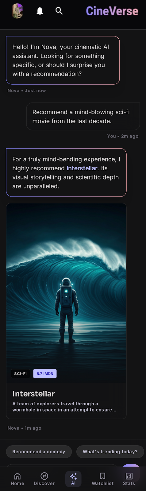

# 🎬 CineVerse

CineVerse is a modern cross-platform movie discovery application built with **Compose Multiplatform**, designed to deliver a premium cinematic experience across platforms.

The application allows users to discover movies, watch trailers, manage personal watchlists, track viewing statistics, interact with an AI movie assistant, and personalize their profiles through a modern Netflix-inspired interface.

---

## 📷 Application Preview

  
  
  

  
  
  

  
  
  

  
  
  

  
  
  

  
  
  

  
  
  

  
  
  

  
  
  

  
  
  

---

## ✨ Features

### 🎥 Movie Discovery

* Browse popular movies.
* Explore trending content.
* View movie details.
* Similar movie recommendations.
* High-quality posters and artwork.

### 🎞 Movie Details

* Movie overview.
* IMDb rating.
* Runtime information.
* Age rating.
* Cast information.
* Related movie suggestions.
* Trailer support.

### 📺 Trailer Streaming

* Watch trailers directly inside the app.
* Smooth playback experience.
* Modern media controls.

### ❤️ Watchlist

* Save movies for later.
* Remove movies from watchlist.
* Persistent local storage.
* Fast retrieval using local database.

### 📊 Statistics Dashboard

Track your movie activity with:

* Total watched movies.
* Total watch time.
* Cine Rank system.
* Weekly watch activity.
* Favorite genres.
* Achievements & badges.
* Real-time updates.

### 🤖 CineNova AI Assistant

An intelligent movie assistant capable of:

* Movie recommendations.
* Genre suggestions.
* Trending movie discovery.
* Personalized movie discussions.
* Future support for OpenAI / Gemini integration.

### 👤 User Profile

* Custom profile.
* Bio editing.
* Watch statistics.
* Achievements showcase.
* Watchlist preview.
* Account customization.

### ⚙ Settings

* Notification preferences.
* Account management.
* Future premium features support.

---

# 🏗 Architecture

The project follows modern Android/KMP architecture principles:

* Clean Architecture
* MVVM Pattern
* Repository Pattern
* State Management with StateFlow
* Dependency Injection with Koin
* Firebase Backend Integration

Structure:

presentation/
domain/
data/
di/
navigation/
ui/

---

# 🛠 Tech Stack

### UI

* Compose Multiplatform
* Material 3
* Voyager Navigation

### Backend

* Firebase Authentication
* Firebase Realtime Database

### Networking

* Ktor Client
* REST APIs

### Local Storage

* Room Database

### Dependency Injection

* Koin

### Async Programming

* Kotlin Coroutines
* Flow
* StateFlow

---

# 📱 Screens

## Home

* Featured movies.
* Categories.
* Discover content.

## Movie Details

* Full movie information.
* Trailer support.
* Similar movies.

## Watchlist

* Saved movies.
* Quick access.

## Statistics

* Watch history analytics.
* Cine Rank.
* Achievements.

## AI Assistant

* Smart movie recommendations.
* Personalized conversations.

## Profile

* User information.
* Achievements.
* Favorite genres.

## Edit Profile

* Change profile details.
* Update profile image.
* Edit biography.

---

# 🔥 Firebase Structure

users/
├── uid/
│ ├── profile/
│ ├── stats/
│ ├── watchHistory/
│ ├── achievements/

achievements/
movies/

---

# 📈 Statistics System

The app automatically tracks:

* Movies watched.
* Total watch time.
* Weekly activity.
* User rank progression.
* Achievement unlocking.

Ranks:

* Rookie
* Pro
* Expert
* Master

---

# 🤖 AI Assistant

The CineNova AI Assistant is designed to provide:

* Smart recommendations.
* Movie discussions.
* Personalized suggestions.
* Future conversational memory support.

Supported integrations:

* OpenAI GPT
* Google Gemini
* Custom AI Models

---

# 🚀 Future Roadmap

### Social Features

* Follow users.
* Share watchlists.
* Community recommendations.

### AI Improvements

* Voice conversations.
* AI movie search.
* Personalized recommendations.

### Advanced Analytics

* Viewing habits.
* Genre analysis.
* Monthly reports.

### Cross Platform

* Android
* iOS
* Desktop

---

# 👨‍💻 Developer

Ahmed Mohamed

Android & Compose Multiplatform Developer

Specialized in:

* Kotlin
* Compose Multiplatform
* Firebase
* Clean Architecture
* Mobile Application Development

---

## ⭐ If you like the project, consider giving it a star.
